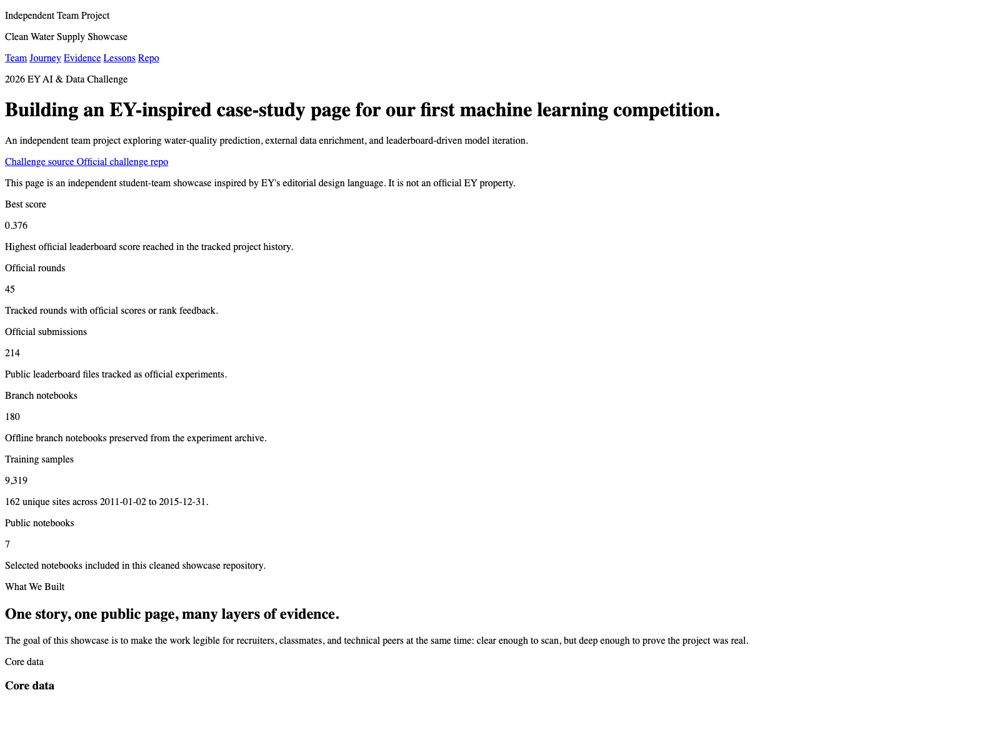
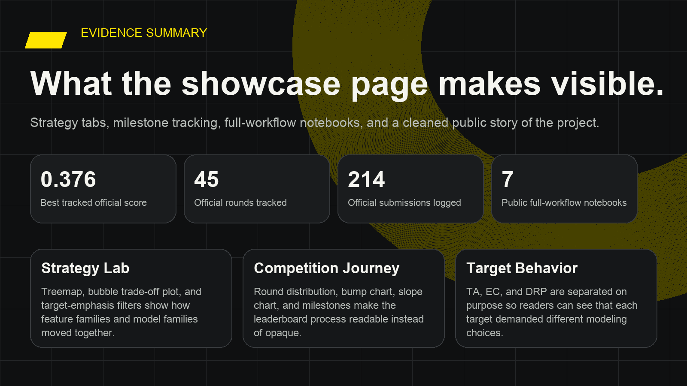

# EY Water Challenge Showcase

> An EY-inspired public case-study page for our first machine learning competition.

<p align="center">
  <a href="https://flalagogogo.github.io/ey-water-2026-showcase/"><strong>Live Showcase</strong></a>
  ·
  <a href="https://github.com/FlalaGoGoGo/ey-water-2026-showcase/tree/main/notebooks"><strong>Selected Notebooks</strong></a>
  ·
  <a href="https://github.com/FlalaGoGoGo/ey-water-2026-showcase/blob/main/linkedin/post_draft.md"><strong>LinkedIn Draft</strong></a>
  ·
  <a href="https://github.com/Snowflake-Labs/EY-AI-and-Data-Challenge"><strong>Official Challenge Repo</strong></a>
</p>



## Start Here

If you only open two things, open these:

- [Live GitHub Pages showcase](https://flalagogogo.github.io/ey-water-2026-showcase/)
- [Selected notebook collection](notebooks/)

Additional useful entry points:

- [Public notebook guide](notebooks/README.md)
- [Public evidence bundle](docs/assets/data/showcase_data.json)
- [LinkedIn post draft](linkedin/post_draft.md)
- [Official EY challenge page](https://challenge.ey.com/)

## Project Snapshot

| Item | Value |
| --- | ---: |
| Best tracked official leaderboard score | `0.376` |
| Official rounds tracked in the project history | `45` |
| Official submissions preserved in the tracking archive | `214` |
| Public full-workflow notebooks in this repo | `7` |
| Training observations used in the showcase summary | `9,319` |
| Unique sampling sites | `162` |

## What This Repository Is

This repository is a cleaned public-facing version of our larger working project for the **2026 EY AI & Data Challenge: Optimizing Clean Water Supply**.

Instead of publishing every raw experiment artifact, we reorganized the work into a more readable story:

- an `EY-inspired` GitHub Pages site in `docs/`
- selected public notebooks in `notebooks/`
- a curated evidence bundle in `docs/assets/data/`
- outreach assets for LinkedIn in `linkedin/`

The goal is simple: make the work understandable for recruiters, classmates, and technical readers without forcing them to dig through dozens of round folders.

## Preview the Showcase

<table>
  <tr>
    <td width="50%">
      
    </td>
    <td width="50%">
      
    </td>
  </tr>
  <tr>
    <td>
      <strong>Homepage story layer</strong><br />
      Challenge framing, team section, project snapshot, and live links.
    </td>
    <td>
      <strong>Evidence wall layer</strong><br />
      Strategy tabs, target behavior plots, and leaderboard progression charts.
    </td>
  </tr>
</table>

## What We Explored

This project evolved as a full experimentation program rather than a single notebook run.

Main method families included:

- benchmark reproduction and challenge-package validation
- separate target-wise modeling for `TA`, `EC`, and `DRP`
- Landsat and TerraClimate feature enrichment
- hydro, weather, terrain, and rainfall feature probes
- leaderboard-guided calibration, gating, and fallback logic
- round-by-round failure review when aggressive pushes did not generalize

## Selected Notebook Philosophy

The notebooks in this public repo are not short update patches.

Each selected notebook is meant to be legible on its own and begins from the start of the workflow:

- package imports
- data loading from the official GitHub challenge files
- cleaning and feature preparation
- model or strategy construction
- export logic and result diagnostics

Current public notebook set:

- `reference_benchmark_model_notebook_snowflake.ipynb`
- `v11_4_guard_ec.ipynb`
- `v15_3_ta_refine_push.ipynb`
- `v20_4_ta_ec_struct_farcal_alt.ipynb`
- `v37_5_ta40_ec40_push.ipynb`
- `v38_5_chirps_delta_safe.ipynb`
- `v42_5_ta60_ec60_challenger_push.ipynb`

## Repository Structure

```text
docs/                         GitHub Pages site
docs/assets/data/             public JSON bundle that powers the charts
docs/assets/images/           team portraits and site images
notebooks/                    selected public full-workflow notebooks
notebooks/assets/             helper CSV assets used by later notebooks
linkedin/                     post draft and social assets
scripts/build_showcase_data.py
scripts/build_public_notebooks.py
screenshots/                  README preview images
```

## Run Locally

### 1. View the published site locally

```bash
cd ey-water-2026-showcase
python3 -m http.server 8000
```

Then open `http://localhost:8000/docs/`.

### 2. Rebuild the public data bundle

```bash
cd ey-water-2026-showcase
python3 scripts/build_showcase_data.py
python3 scripts/build_public_notebooks.py
```

## Team

- [Flala Zhang](https://www.linkedin.com/in/flala/) | [GitHub](https://github.com/FlalaGoGoGo)
- [Lily Wang](https://www.linkedin.com/in/xueying-lily-wang/) | [GitHub](https://github.com/wxy95929-byte)
- [Marcus Yu](https://www.linkedin.com/in/marcus-cf-yu/) | [GitHub](https://github.com/themarcusyu)

## Disclosure

- This is an **independent team project** inspired by EY's editorial design language.
- It is **not** an official EY property.
- Challenge references are included for attribution and context only.

## Source References

- [EY challenge page](https://challenge.ey.com/)
- [Official challenge repository](https://github.com/Snowflake-Labs/EY-AI-and-Data-Challenge)
